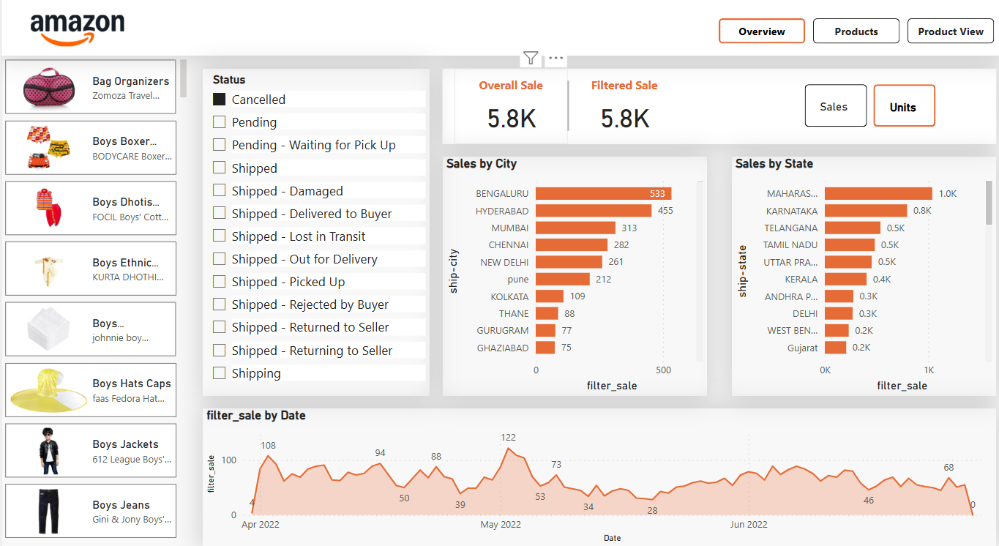
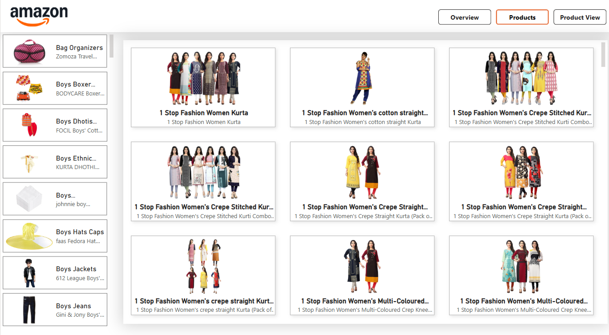

# amazon-sales-dashboard
# 📊 Amazon Sales Dashboard - Power BI Project

This project is a visual analytics dashboard built using **Power BI** that analyzes Amazon product sales data. The dashboard provides insights into sales performance by city, state, product category, and shipping status over time.

---

## 📌 Key Features

- 📦 **Sales by Product**: Analyze top-selling products like boys’ clothing, bag organizers, etc.
- 🌆 **Sales by City**: Visualizes units sold in major cities like Bengaluru, Hyderabad, Mumbai, etc.
- 🗺️ **Sales by State**: Track state-wise sales across India.
- 📈 **Sales Trend Over Time**: A line chart showing sales trends from April to July 2022.
- 🚚 **Order Status Overview**: Detailed breakdown of order statuses like Shipped, Cancelled, Returned, etc.

---

## 🔧 Tools & Technologies Used

- **Power BI** – Data visualization
- **DAX** – Measures and calculated columns
- **Power Query** – Data transformation
- **Amazon Dataset** – Simulated or real-world e-commerce data

---

## 📷 Dashboard Screenshots

### 🖼️ Overview Page

### 🛍️ Product View

---

## 📁 Project Structure

